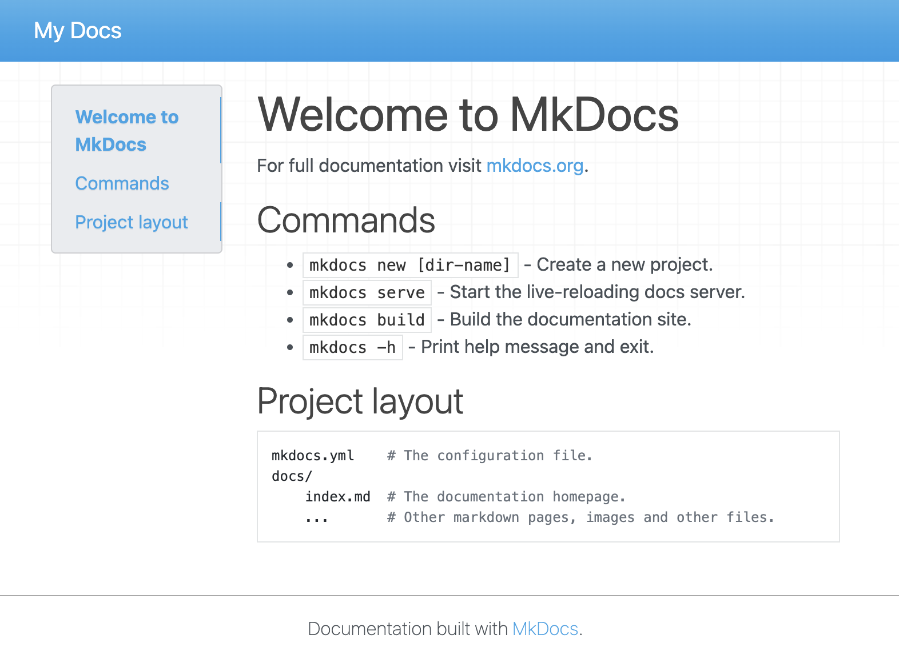
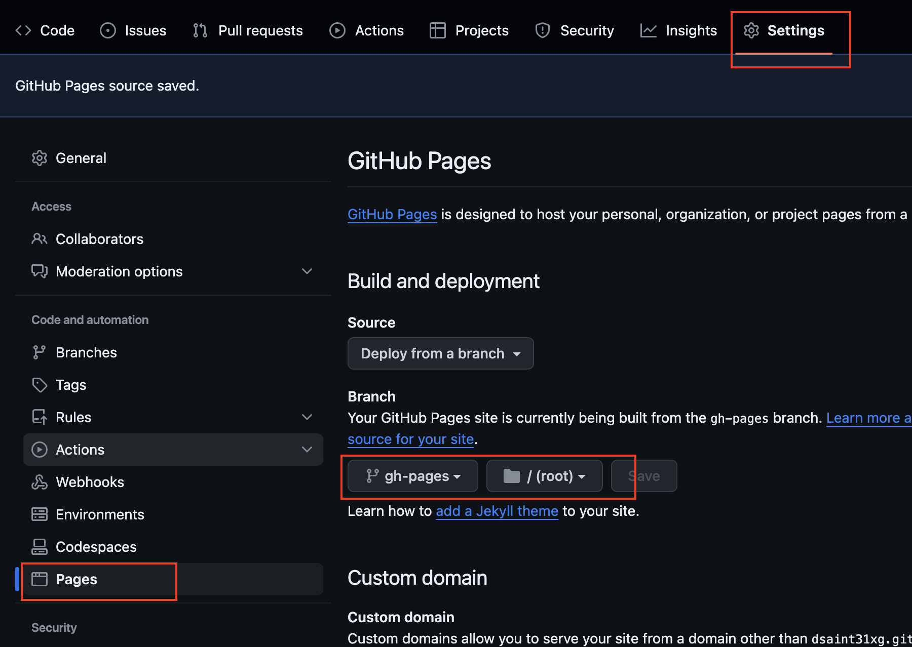

# MkDocs 에 대해서.

[Jekyll](https://jekyllrb.com/docs/), [shinx](https://www.sphinx-doc.org/en/master/), [read docs](https://about.readthedocs.com/?ref=readthedocs.org) 등과 함께 대표적인 ***static site generator*** (정적 사이트 생성기) 로 정적인 웹문서 위주의 사이트를 만드는데 적합한 tool임.

## 장점.

`Python`과 `Markdown`에 익숙한 사용자의 경우, 매우 간단하게 정적인 문서로 구성된 사이트를 생성할 수 있음.

`github.com`의 페이지 `github.io`와 연동도 지원함 (기본으로 제공되는 Jekyll 만큼 간단함.)

## Jekyll 과의 비교.

`Ruby`로 작성된 Jekyll에 비해 보다 쉬운 환경설정을 자랑하는 MkDocs 임.

단, Jekyll은 개인 블로그나 웹사이트에 보다 적합하며 플러그인 등에서 보다 지원이 큰 편임. 
때문에 MkDocs에 비해 높은 자유도의 옵션을 제공하지만 보다 높은 학습량을 요구함.

* [Official Site](https://www.mkdocs.org/)

---

---

# Install MkDocs

`conda` 를 이용한 설치를 가정함.

## conda 이용한 `mkdocs` 설치

terminal에서 다음의 명령어를 입력하면,
`conda`를 이용하여 `mkdocs`라는 가상환경을 만들고, 여기에 `mkdocs`를 설치함.

```bash
conda create -n mkdocs -c conda-forge mkdocs
```

---

## mkdocs 프로젝트 생성.

`new` 를 이용하여 mkdocs로 문서 사이트를 관리하기 위한 mkdocs 프로젝트 경로를 생성함.

다음은 `ce`라는 directory가 생성되고 해당 디렉토리가 mkdocs로 문서들을 만들고 관리하는 작업 프로젝트의 root directory가 됨.

```bash
mkdocs new ce
```

위 명령어 결과로 다음의 direcgtory 구조의 `ce`가 생성됨.

```
ce
├── docs
│   └── index.md
└── mkdocs.yml
```

---

## 동작 확인.

우선 작업 디렉토리 `ce`로 들어가서 정상 설치되었는지를 다음 명령어로 확인.

```bash
cd ce
mkdocs serve
```

다음과 같은 메시지가 나오고 로컬 서버에서 mkdocs로 만들어진 문서 사이트가 서비스 됨.

```
❯ mkdocs serve
INFO    -  Building documentation...
INFO    -  Cleaning site directory
INFO    -  Documentation built in 0.03 seconds
INFO    -  [21:51:00] Watching paths for changes: 'docs', 'mkdocs.yml'
INFO    -  [21:51:00] Serving on http://127.0.0.1:8000/``
```


이후, `http://127.0.0.1:8000` URL을 웹브라우저로 확인 가능함.



---

## 문서 사이트 build하기.

다음의 명령어를 수행할 경우 문서사이트의 파일들(html 등등)이 
`site` 라는 이름의 sub-directory에 생성됨.

```bash
mkdocs build
```

그 결과는 다음과 같음.

```
ce
├── docs
│   └── index.md
├── mkdocs.yml
└── site
    ├── 404.html
    ├── css
    │   ├── base.css
    │   ├── bootstrap.min.css
    │   └── font-awesome.min.css
    ├── fonts
    │   ├── fontawesome-webfont.eot
    │   ├── fontawesome-webfont.svg
    │   ├── fontawesome-webfont.ttf
    │   ├── fontawesome-webfont.woff
    │   └── fontawesome-webfont.woff2
    ├── img
    │   ├── favicon.ico
    │   └── grid.png
    ├── index.html
    ├── js
    │   ├── base.js
    │   ├── bootstrap.min.js
    │   └── jquery-3.6.0.min.js
    ├── search
    │   ├── lunr.js
    │   ├── main.js
    │   ├── search_index.json
    │   └── worker.js
    ├── sitemap.xml
    └── sitemap.xml.gz

8 directories, 23 files
```

---
 
---

# Github의page와 연동.

mkdocs의 문서 프로젝트의 root (위의 예에선 `ce`) 에서 다음의 명령어로 github의 repository와 연결.

* 반드시 연결될 github의 remote repository는 public이여야함.


```bash
git init
git add .
git commit -m "first commit"
git remote add origin <github의 repository 주소>
git branch -M main
git push -u origin main
```

이후, 다음 명령어로 `gh-deploy` 브랜치로 생성된 문서 사이트를 push.

```bash
mkdocs gh-deploy
```

이후 github의 대상 remote repository에서 `settings` 에서

`Pages`를 선택하고, `Build and deployment` 에서 `gh-pages` 브랜치에서 서비스 되도록  
아래 그림과 같이 설정을 바꿔줌.


* `dsaint31xg`가 github의 id임.
* `ce`가 remote repostory의 이름.
* 이 경우, `git@github.com:dsaint31xg/ce.git`이 `<github의 repository 주소>` 임(ssh사용의 경우)


이후 `<github_user_id>.github.io/<remote repository의 이름>` URL에서 서비스 됨.

* 이 경우, `dsaint31xg.github.io/ce` 의 URL에서 서비스 됨.


